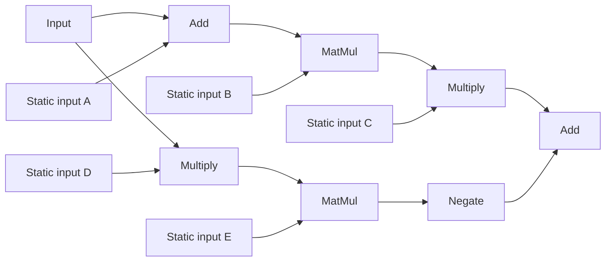
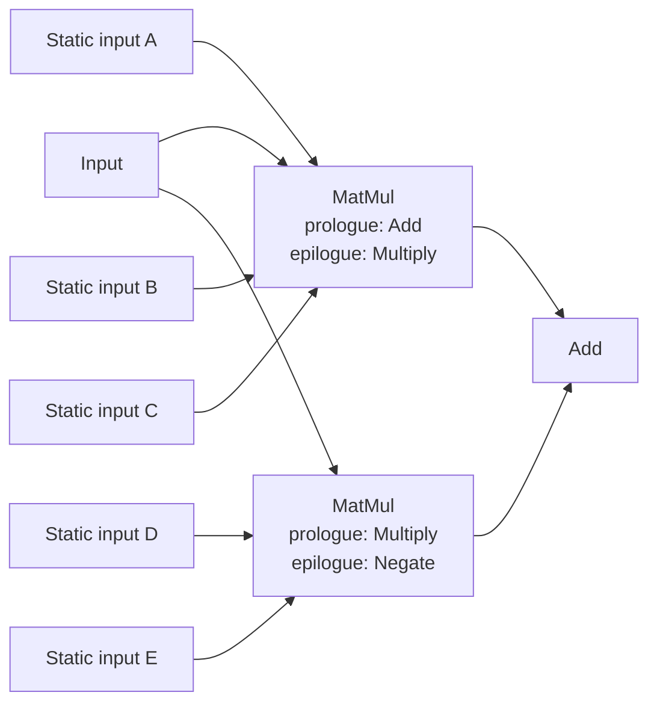

# wgpu-compute

## Why should this library exist?

Most machine learning libraries are designed as frameworks. This choice is
reasonable as long as the application itself is just machine learning. That
changes when machine learning is only a small, integrated part of a larger
system. In those cases, the complex CPU-side machinery and hardware
abstractions can make integration difficult and inefficient.

Consider a scenario where the skybox of a game is supposed to be generated
by a neural network to enable efficient rendering of realistic
procedural clouds. Ideally, the network is just another couple of dispatches
in the existing command encoder, processing and outputting resources
already managed by the application.

With a conventional framework, however, this is often not the case. Instead,
hundreds of dependencies are pulled into the project, and the generated output
may even have to cross backend boundaries or be transferred through the CPU.
Usually, this also involves an expensive GPU-CPU synchronization round trip
that was not really necessary to begin with.

At this point, it often makes more sense to manually implement the model
in shaders, without utilizing the highly optimized shaders a dedicated library
would have shipped.

This library is supposed to fill the gap by providing an interface capable
of attaching to arbitrary wgpu command encoders and working with resources in
wgpu buffers natively. This also means designing the API around wgpu's
constraints instead of accepting lower performance.

## Roadmap
This is not the first attempt at writing this library, and a reasonable CPU-side
interface has already been discovered. None of it is set in stone, of course,
and new ideas are always welcome. The arguably more interesting part is the
virtual machine (the following sections explain what this is) running in each
workgroup. It will be written in WESL, an extension of WGSL that
enables imports and conditional compilation. So the first step in this project
will consist of implementing virtual memory, parts of the virtual instruction
set, and a few basic mainloops (also explained later) in shaders.

The second step is then the CPU-side code required to evaluate basic graphs.
Since most of the API design already exists as concrete ideas, this part is
expected to require less time than the first one.

At this point, a somewhat usable API should be present, and effort can be spent
on implementing more mainloops, more efficient shaders, and autograd. Further
stages will also be planned here.

## Virtual machine design
A straightforward way of evaluating compute graphs with wgpu is to store each tensor
in a dedicated buffer and then launch a dispatch which binds some buffers as inputs
and another buffer as output. Let's consider this example graph:



> [!NOTE]
> A straightforward implementation could evaluate every operation separately:
>
> **1. Add**
> - bind `input` as input 0
> - bind `static input A` as input 1
> - bind `temporary 0` as output
> - dispatch `Add`
>
> **2. MatMul**
> - bind `temporary 0` as input 0
> - bind `static input B` as input 1
> - bind `temporary 1` as output
> - dispatch `MatMul`
>
> **3. Multiply**
> - bind `temporary 1` as input 0
> - bind `static input C` as input 1
> - bind `temporary 2` as output
> - dispatch `Multiply`
>
> **4. Multiply**
> - bind `input` as input 0
> - bind `static input D` as input 1
> - bind `temporary 3` as output
> - dispatch `Multiply`
>
> **5. MatMul**
> - bind `temporary 3` as input 0
> - bind `static input E` as input 1
> - bind `temporary 4` as output
> - dispatch `MatMul`
>
> **6. Negate**
> - bind `temporary 4` as input 0
> - bind `temporary 5` as output
> - dispatch `Negate`
>
> **7. Add**
> - bind `temporary 2` as input 0
> - bind `temporary 5` as input 1
> - bind `output` as output
> - dispatch `Add`

While perfectly valid, this approach has two rather severe issues.

First of all, allocating tons of medium-sized temporary buffers just to throw
them away once they are no longer needed would result in a large number of API
calls and potentially significant memory fragmentation. This is especially
problematic during training, where temporary buffers can make up a large part
of the overall memory usage. Of course, one could try to cache temporary
buffers, but doing so introduces its own allocation and fragmentation problems.

The second problem is the lack of kernel fusion, one of the most important
optimizations in machine learning.

Instead of running the first addition and storing its result in a temporary
buffer, it could be fused into the first matrix multiplication. Whenever an
invocation in the matrix multiplication wants to load an element from its input,
it does not perform a simple load anymore. Instead, it fetches the corresponding
elements from input and static input A and adds them together.

This avoids writing the intermediate tensor to memory only to read it again
immediately afterwards, although you have to be a bit careful here because
matmuls can load a value multiple times.

The fused addition forms what this library calls a prologue. The matrix
multiplication itself is called the mainloop. Operations fused after the
mainloop form the epilogue.

In general, prologues and epilogues consist of operations that can be evaluated
independently for each requested element, such as element-wise operations or
index mappings like broadcasts. Mainloops, on the other hand, are operations
that require cooperation or synchronization between multiple elements.

This distinction matters because wgpu currently provides synchronization only
between invocations within the same workgroup. There is no way for one
workgroup in a dispatch to wait for arbitrary other workgroups in that dispatch.

Attempting to fuse two matrix multiplications, for example, could require the
second one to consume tiles produced by several workgroups of the first one.
That would require inter-workgroup synchronization, which cannot be expressed
directly in WGSL.

Let's look at a fused version of the graph:


> [!NOTE]
>
> After fusing the element-wise operations into the matrix multiplications, the
> graph can be evaluated using only three dispatches:
>
> **1. Fused MatMul**
> - bind `input` as input 0
> - bind `static input A` as prologue input
> - bind `static input B` as mainloop input
> - bind `static input C` as epilogue input
> - bind `temporary 0` as output
> - dispatch `MatMul` with `Add` prologue and `Multiply` epilogue
>
> **2. Fused MatMul**
> - bind `input` as input 0
> - bind `static input D` as prologue input
> - bind `static input E` as mainloop input
> - bind `temporary 1` as output
> - dispatch `MatMul` with `Multiply` prologue and `Negate` epilogue
>
> **3. Add**
> - bind `temporary 0` as input 0
> - bind `temporary 1` as input 1
> - bind `output` as output
> - dispatch `Add`

If you have worked with GPUs before, you know that those bindings are declared
statically in shaders. Every single one of those dispatches now requires a fully
custom shader + pipeline. This is where a lot of the complexity of conventional
frameworks originates. Not only does this require generating code, often at runtime,
but this code also has to be compiled. By the nature of how GPUs work today,
this requires the involvement of multiple compilers and a LOT of work for the CPU.

Additionally, there is a more subtle wgpu-specific issue. The number of storage
buffers visible to a shader stage is extremely limited: only 8 by default. These
bindings are shared by the entire fused shader, and there are also strict limits
on how large a single storage-buffer binding can be, so these shaders can't become
too complex. Auto-generating shaders can also cause major issues with register
pressure and is in general a very hard problem to solve.

This is what eventually led to the idea of having a virtual machine in each
workgroup. Instead of having a custom shader for all of the operations, there is
only one which interprets instruction streams around a mainloop. Each input to the
mainloop has its own prologue instruction stream, and each output has its own
epilogue instruction stream.

As an example, the first matmul would receive the following stream for its first
input, which it executes whenever a lane wants to load a value at a given location:

```
LOAD REG0, INPUT
LOAD REG1, STATIC_A
ADD  REG0, REG0, REG1
```

The result eventually lands in REG0 and can be used by the mainloop. Since the
interpreter follows the same instruction stream across all lanes within a
workgroup and there are only a few instructions, this has the potential to be
quite efficient, even in comparison to a normal fused kernel.

The last piece of the puzzle is virtual memory. When the device is initialized,
a fixed amount of memory will be allocated in larger, equally sized buffers.
These buffers form the global memory pool and are always bound to all dispatches.
Internally, the pool is made up of memory pages, and a tensor is just an integer
pointing towards a specific page index.

If the tensor is small enough to be contained in a single page, this virtual
pointer points directly towards its data. Otherwise, the page contains a page
table with pointers to the actual data pages.

This essentially removes the "8 storage buffers per shader stage" limitation for
individual tensors and allows a tensor to span multiple pages rather than being
limited to a single storage-buffer binding. It also enables the use of an
extremely efficient ring-buffer free-list allocator with a bounded amount of
internal fragmentation per tensor, bypassing the wgpu allocation machinery
completely.

> [!NOTE]
> ### Evaluation using virtual memory
>
> The global memory pools are bound once before evaluating the graph:
>
> - bind `memory pool 0`
> - bind `memory pool 1`
> - ...
>
> Tensors referenced by the instruction streams are now virtual pointers into
> these pools.
>
> **1. MatMul**
>
> Input 0 prologue:
> ```text
> LOAD REG0, INPUT
> LOAD REG1, STATIC_A
> ADD  REG0, REG0, REG1
> ```
>
> Input 1 prologue:
> ```text
> LOAD REG0, STATIC_B
> ```
>
> Output 0 epilogue:
> ```text
> LOAD REG1, STATIC_C
> MUL  REG0, REG0, REG1
> STORE TEMPORARY_0, REG0
> ```
>
> - dispatch `MatMul`
>
> **2. MatMul**
>
> Input 0 prologue:
> ```text
> LOAD REG0, INPUT
> LOAD REG1, STATIC_D
> MUL  REG0, REG0, REG1
> ```
>
> Input 1 prologue:
> ```text
> LOAD REG0, STATIC_E
> ```
>
> Output 0 epilogue:
> ```text
> NEG   REG0, REG0
> STORE TEMPORARY_1, REG0
> ```
>
> - dispatch `MatMul`
>
> **3. Add**
>
> Input 0:
> ```text
> LOAD REG0, TEMPORARY_0
> ```
>
> Input 1:
> ```text
> LOAD REG0, TEMPORARY_1
> ```
>
> Output 0:
> ```text
> STORE OUTPUT, REG0
> ```
>
> - dispatch `Add`

Lastly, the mainloop can be chosen dynamically, so we really only need one
shader. Since all the bindings are always the same, there is nothing stopping
us from including multiple mainloops in one dispatch, eventually forming a wave.
With this technique, the example graph can be reduced to as few as two
dispatches.

There are a lot more subtle things to this architecture which should be
documented in a separate folder in this repository in the future. Don't hesitate
to ask questions or bring forward your own ideas on Discord:
[Discord](https://discord.com/users/1514991610784387124).
